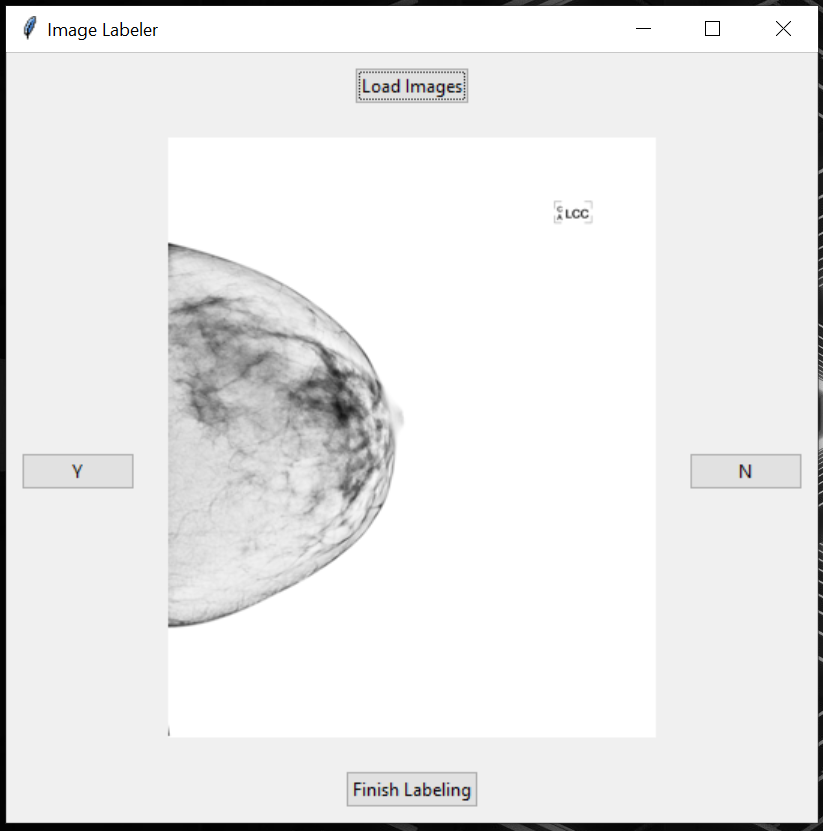

# MammoScreen

MammoScreen is a browser-based Streamlit application for reviewing and labeling mammography images, including DICOM uploads processed fully in memory.

## Features

- Upload `JPG`, `JPEG`, `PNG`, `BMP`, and `DICOM` files from the browser
- View one image at a time with previous/next navigation
- Label images as `Positive`, `Negative`, `Uncertain`, or `Skip`
- Edit earlier labels and add optional notes
- Export labels as CSV
- Keep uploaded data in session memory instead of writing it to disk

## Project Layout

```text
MammoScreen/
├── app.py
├── src/
├── tests/
├── sample_data/
├── legacy/
├── .streamlit/
├── Dockerfile
└── docker-compose.yml
```

The original Tkinter desktop application is preserved in `legacy/MammoScreen.py`.

## Local Development

```bash
pip install -r requirements.txt
streamlit run app.py
```

The app will open on `http://localhost:8501`.

## Testing

```bash
pytest
```

## Docker

```bash
docker compose up --build
```

## Screenshot

<p float="left">
  
</p>

## License

[MIT](https://choosealicense.com/licenses/mit/)
